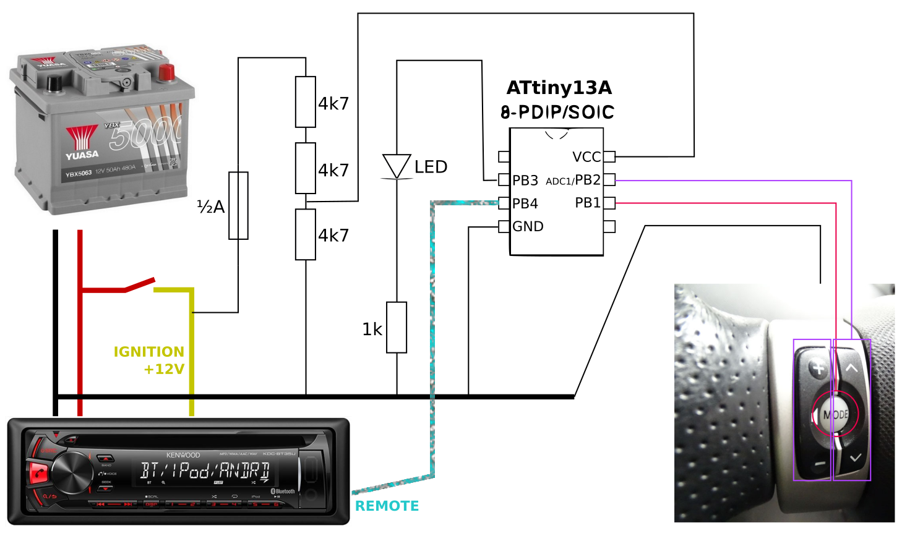

Toyota 2006 Yaris Steering Wheel Controls to Kenwood NEC Remote Protocol Adaptor
================================================================================

Why spend £30 on an adaptor when you can spend hours on DIY instead (and potentially learn something)?

I'm using this with an ATtiny13a in the circuit illustrated by this snazzy and extremely legible diagram:

The steering wheel buttons introduce resistors between the pink/purple wires and the black wire. So, the black wire is grounded, and we use the internal pull-ups on the GPIO pins to get one analogue and one digital input. The remote wire is pulled up to 3v3 by the radio, so that pin starts tri-stated, and is intermittently grounded to transmit the remote protocol's pulses.

The volume and prev/next (up/down) buttons do their usual thing.

The MODE button has three functions:

- Press once for mute/unmute (useful to quickly deal with annoying audio ads, or passenger phone calls).

- Double-press for play/pause. (On the second press, the first press's mute will be unmuted before play/pause is sent.)

- Hold — and then repeatedly press — for source switching.

The code is barely optimized; just enough to make it fit in the 1kB available. To modify it with more functions, you might need to improve the code layout, or just buy an ATtiny with more flash memory!

Your individual microcontroller and power supply might see different analogue values from the switches' resistors. See `measurement2` branch for program to read out values with the LED.

An earlier version of this project used an (expensive) Arduino Micro in place of the ATtiny. See other branch for (out-of-date) Arduino code.

This has been tested with a UK Yaris II from early 2006, and a Kenwood KDC-BT35U radio.

Power supply
------------

Yes, it's a resistor divider. Cheap, robust, simple, and with trustworthy and adequate upper and lower bounds on voltage.

A possible enhancement could be a decoupling capacitor across the microcontroller, and it might also be sane to use a ~5v5 Zener diode to protect it against surprise spike incidents. However it seems totally stable as it is, and I am enjoying the experiment.

The reason it's possible to get away with this is that the ATtiny, clocked at 128kHz and in the voltage range it's operating at, draws significantly less than one milliamp! Obviously this is negligible compared to the power consumption of the radio itself, so I can't really be bothered with the extra complexity of using more components to try and handle that tiny current more efficiently.

Testing is vital, so of course the controller was tested extensively while powered via the same resistors from a supply between 10 and 15 volts (the "very low battery" up to "charging" range). The resistors keep it well within its voltage specifications across the whole range, and it's stable down to about 9.8v (at which point it would be long past time to charge the battery anyway) where the ATtiny's brown-out detector intermittently causes it to reset (good).

I tapped into the radio's power wires with Wago 222 blocks because I had dozens of them available at the time. They are rated for much higher continuous current than the capacity of the radio circuit, are compatible with the right kinds of flex cable, and seem to work very neatly and well.

For my 12v wire I used a pre-made "wire with inline blade fuse" assembly bought cheaply from eBay, fitted another Wago on the end for insulation, and fitted a 0.5A fuse (the lowest rating I could find), to prevent things from getting too messy if I made a mistake in the testing enclosure. (Having easy access to the chassis ground everywhere makes working on vehicles very easy/fun/confusing/dangerous depending on what you're doing at the time. A car battery is enough of a power supply to do some (really bad) welding!)

None of this should be taken as advice; anything you do is your own responsibility.

Useful sources
--------------

- [SB-Projects' explanation of NEC protocol](https://www.sbprojects.net/knowledge/ir/nec.php) (2001)
- [My previous Raspberry Pi "NAD Link" project (also NEC protocol)](https://github.com/tsprlng/nad-link) (~2015)
- [Matti Kantola's equivalent project for Renault Megane](http://www.angelfire.com/nd/maza/kenwood.html) (2000)

Note that in this case, any mentions of 38kHz carriers in the remote protocol are not relevant. The remote wire from the radio is effectively expecting what would be the inverted remote signal after detection and filtering -- so just needs pulling to ground where the carrier would be on, or leaving to be pulled up to 3v3 where it would be off.

Here, for archival purposes, are all the Kenwood remote codes from Matti Kantola's page, which I could not find elsewhere!

Without these, it would have been an impossible nightmare.

| meaning    | code   |
|------------|--------|
| tuner      | 0xb91c |
| tape       | 0xb91d |
| cd         | 0xb91e |
| cd-md-ch   | 0xb91f |
| track-     | 0xb90a |
| track+     | 0xb90b |
| rew        | 0xb90c |
| ff         | 0xb90d |
| dnpp (?)   | 0xb95e |
| play/pause | 0xb90e |
| ---        |        |
| volume+    | 0xb914 |
| volume-    | 0xb915 |
| source     | 0xb913 |
| mute       | 0xb916 |
| ---        |        |
| 0          | 0xb900 |
| 1          | 0xb901 |
| 2          | 0xb902 |
| 3          | 0xb903 |
| 4          | 0xb904 |
| 5          | 0xb905 |
| 6          | 0xb906 |
| 7          | 0xb907 |
| 8          | 0xb908 |
| 9          | 0xb909 |
